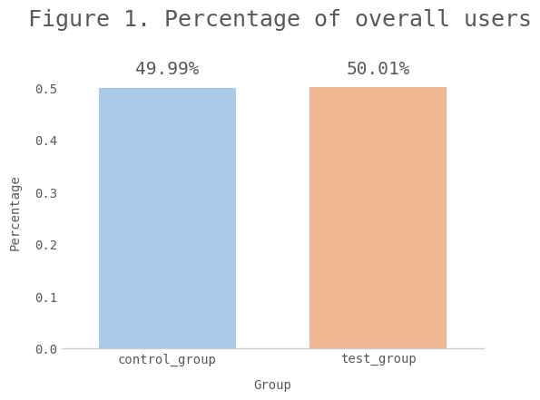
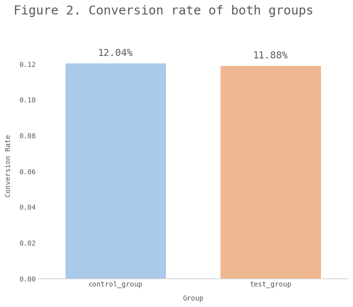
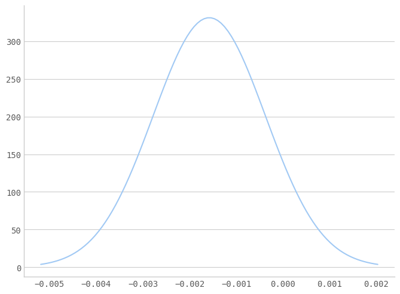
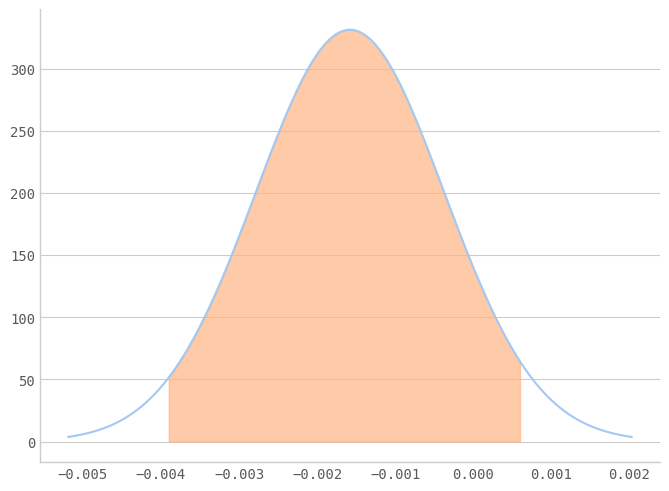

# Landing Page A/B Test Result Analysis
<p align="center">	
	
</p>
<p align="center">

## Introduction
An A/B test is an experiment in which you test two different values of the same variable against one another to determine which one is “better” by evaluating their performance among two randomly assigned groups of real users.

In this project, I will focus more on the ab test result analysis. The typical ab testing process is to randomly select a subset of users, show them the new feature, and monitor this group's conversion behavior compared to the other users. We can then observe whether one group converts at a higher rate than the other.
The data I am using for this project is from Kaggle. The dataset contains the conversion rates of two groups (control and treatment) exposed to different landing pages. The dataset comprises twenty-nine thousand rows of data points.

## Clean the data and check sanity

To begin with, we will need to clean the data and run some sanity checks to make sure the experiment results reflect the initial design and remove some confounding variables. If we track an average goal such as average metric(average revenue per user), then the presence of outliers like few abnormally large orders may easily skew the test result. The solution to the problem is keeping an eye on those outliers in the test result in the first place. 

<p align="center">	
	
</p>
<p align="center">
  <i>Figure 1.</i> 
</p>

From Figure 1, we can compare the percentage of overall users in each group to ensure no obvious bias in our assignment procedure. For example, we should confirm the size of the groups is comparable. If we have other relevant demographics data, we should also compute our percentage calculation broken out by the demographics to confirm our result is genuinely random across cohorts.

<p align="center">	
	
</p>
<p align="center">
  <i>Figure 2.</i> 
</p>

Figure 2 shows the difference between the two groups is so subtle that we cannot make the judgment call whether this difference is statistically significant or merely a result due to randomness. We will need a statistical approach to address this problem, and this is where the p-value comes in.

## Calculate the p-value
The p-value is the probability of observing a value as or more extreme than the observed value under the Null hypothesis. If this value is low, then it means either our power is low, or there is a low probability of observing this value if the Null hypothesis is true. We first define a function that can quickly get the p-value.

``` Python
# Define a fucntion that derives p-values
def get_pvalue(p1, p2, p1_size, p2_size):  
    diff =  abs(p2 - p1)

    scale_one = p1 * (1 - p1) * (1 / p1_size)
    scale_two = p2 * (1 - p1) * (1 / p2_size)
    sd = (scale_one + scale_two)**0.5

    p_value = 2 * (1 - scipy.stats.norm.cdf(diff, loc = 0, scale = sd))

    return p_value
```

It turns out that we are having a p-value of 0.189, which is larger than the confidence level of 0.1, suggesting that we cannot reject the Null hypothesis and cannot conclude which landing page drives more conversions.

## Calculate the statistical power
Even if we have an extremely low p-value, we would still want to look at the power, ensuring that we avoid running an underpowered A/B test. Statistical power is the probability of finding statistically significant results when the Alternative hypothesis is true. The underpowered A/B test means that we don't have an adequate sample size and will significantly increase the chance of getting a false negative result. For example, the test result couldn't find the difference between the control and test groups, whereas the difference actually exists. Statistical power is related to sample size and minimum detectable effect, and it increases with sample size as a large sample size means you collect more information. Additionally, as the confidence level goes up, the power goes down. After applying the `get_power` function, we get a power of roughly 0.26, which is low compared to the widely accepted standard of 0.8.

``` Python
# Define a fucntion that derives statistical power
def get_power(n, p1, p2, cl):
    alpha = 1 - cl
    
    qu = scipy.stats.norm.ppf(1 - alpha/2)
    
    diff = abs(p2 - p1)
    bp = (p1 + p2) / 2
    
    v1 = p1 * (1 - p1)
    v2 = p2 * (1 - p2)
    
    bv = bp * (1 - bp)
    
    power_part_one = scipy.stats.norm.cdf((n**0.5 * diff - qu * (2 * bv)**0.5)/ (v1 + v2)**0.5)
    power_part_two = 1 - scipy.stats.norm.cdf((n**0.5 * diff + qu * (2 * bv)**0.5)/ (v1 + v2)**0.5)
    
    power = power_part_one + power_part_two

    return(power)
```

## Calculate the confidence intervals
For demonstration purposes, I would also provide confidence intervals for our estimate. The confidence interval contextualizes the confidence we have in our estimation process. Specifically, suppose we provide a 95% confidence interval. In that case, we are saying that if we had a series of independent experiments and for each estimated unrelated parameter and a 95% confidence interval, then 95% of the intervals will contain the true parameter. As a result, if we are computing the confidence intervals for two groups separately, there should not be an overlap between them as it indicates that you need perhaps a larger sample size and continue the test. To proceed with the analysis, we will need to define a function that helps us get the confidence intervals.

``` Python
# Define a fucntion that derives confidence interval
def get_ci(diff, cl, sd):
    rng_val = scipy.stats.norm.ppf(1 - confidence_level / 2) * sd
    
    lwr_bnd = diff - rng_val
    upr_bnd = diff + rng_val 
    
    return_val = (lwr_bnd, upr_bnd)
    return(return_val)
```

In this case, the confidence interval falls between -0.00393 and 0.0007, which is quite a wide range and contains zero. Therefore we cannot conclude which landing page drives more conversions.
    
<p align="center">	
	
</p>
<p align="center">
  <i>Figure 3.</i> 
</p>

<p align="center">	
	
</p>
<p align="center">
  <i>Figure 4.</i> 
</p>

## Sample size
Although we put more focus on the result analysis in this project, it is too important to ignore the issue with sample size. If we keep running the test while increasing the sample size as we go, we would at some point get the statistically significant result even if there is not much difference between the control and test group. This is why we should decide on a sample size in advance before running the A/B test. To estimate our needed sample size, we can choose our desired practical significance (minimum detectable effect(MDE)), set our desired confidence level & power, and then estimate our standard error using these values. We can easily do this by leveraging the function defined below.

``` Python 
# Check what sample size is required
practical_significance = 0.005 
confidence_level = 0.05 
power = 0.8 
effect_size = proportion_effectsize(con_conv, con_conv + practical_significance)
sample_size = TTestIndPower().solve_power(effect_size = effect_size, 
					  power = power, 
                                          alpha = confidence_level)
```


It is also important to note that there are various ways to decrease the needed sample size. One is by switching the unit of observation to reduce variability in the data, such as from revenue to conversion because you are decreasing the variation of results. Another way is excluding users or other experimental units that are irrelevant to the process.

## Final Thoughts
I would like to wrap up the analysis by quoting a sentence from [Maths and Stats for Web Analytics and Conversion Optimization](https://www.amazon.com/Maths-Stats-Analytics-Conversion-Optimization/dp/1364849186). "A/B test measure users' performance and not behavior". This is another major drawback of A/B tests and the main reason, and many A/B tests end up failing to bring a real lift in conversions. What we are actually testing is whether version A is better than version B. We are not testing how good version A is in a range of contexts. Perhaps the users would have preferred version C or D if they got the chance to look at it. This is why even after conducting several A/B tests and receiving statistically significant results in each experiment, there is no guarantee that the better version of the feature will result in any real increase in conversion rate or volume. The main factor that really power up the A/B tests is the great understanding of client's business.

## Reference
- [A/B Testing by Google offered by Udacity](https://classroom.udacity.com/courses/ud257)
- [Maths and Stats for Web Analytics and Conversion Optimization](https://www.amazon.com/Maths-Stats-Analytics-Conversion-Optimization/dp/1364849186)
